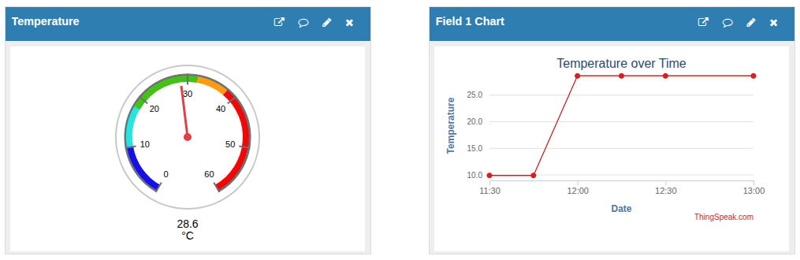
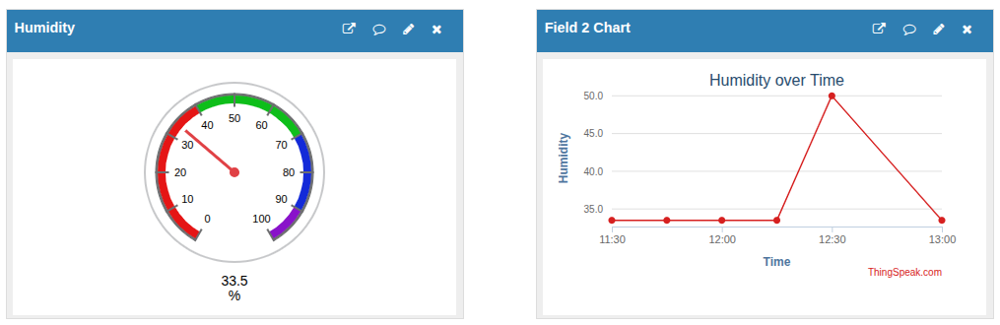
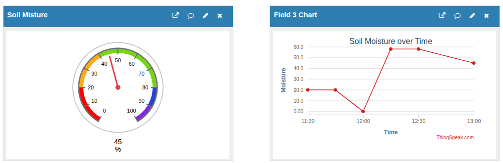
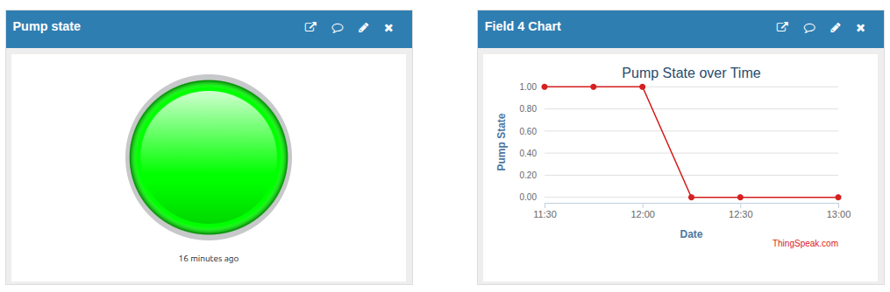

# Smart Greenhouse Monitoring System

An ESP32-based IoT system that monitors greenhouse environmental conditions in real-time and automatically controls irrigation based on soil moisture levels. Sensor data is streamed live to ThingSpeak for remote monitoring and visualization.

**Live Dashboard:** [22ug2-0590.github.io/Smart-Agriculture-Monitoring-System](https://22ug2-0590.github.io/Smart-Agriculture-Monitoring-System/)

---

## Features

- ️ **Temperature & Humidity** monitoring via DHT22 sensor
- **Soil Moisture** sensing with automatic irrigation control
- **Auto Water Pump** triggers when soil moisture drops below 40%
- **16×2 I2C LCD** display for local readout
- ️ **ThingSpeak** cloud dashboard with live charts and gauges
- Data pushed every **16 seconds**
- Simulated on **Wokwi**

---

## ️ Hardware Components

| Component | Details |
|-----------|---------|
| Microcontroller | ESP32 |
| Temp & Humidity Sensor | DHT22 (Pin 15) |
| Soil Moisture Sensor | Analog (Pin 34) |
| Water Pump | Digital output (Pin 5) |
| Display | 16×2 I2C LCD (Address `0x27`) |
| Connectivity | Wi-Fi → ThingSpeak HTTP API |

---

## Wiring Summary

| Component | ESP32 Pin |
|-----------|-----------|
| DHT22 Data | GPIO 15 |
| Soil Moisture (analog) | GPIO 34 |
| Water Pump relay | GPIO 5 |
| LCD SDA | GPIO 21 |
| LCD SCL | GPIO 22 |

---

## ️ ThingSpeak Live Dashboard

> **Channel ID:** [3281752](https://thingspeak.com/channels/3281752)

### ️ Temperature Gauge & Chart


### Humidity Gauge & Chart


### Soil Moisture Gauge & Chart


### Pump State Indicator & Chart


---

## ThingSpeak Channel Fields

| Field | Data | Unit |
|-------|------|------|
| Field 1 | Temperature | °C |
| Field 2 | Humidity | % |
| Field 3 | Soil Moisture | % |
| Field 4 | Pump State | 0 = OFF, 1 = ON |

---

## ️ How It Works

```
┌─────────────┐ reads ┌───────────────────┐
│ DHT22 │ ─────────────► │ │
│ Sensor │ │ ESP32 │
├─────────────┤ reads │ │
│ Soil │ ─────────────► │ • Auto-irrigates │
│ Moisture │ │ if moisture │
├─────────────┤ controls │ < 40% │
│ Water │ ◄───────────── │ • Displays on │
│ Pump │ │ LCD │
└─────────────┘ │ • Uploads data │
 │ to ThingSpeak │
┌─────────────┐ │ every 16s │
│ I2C LCD │ ◄───────────── │ │
│ 16×2 │ └─────────┬─────────┘
└─────────────┘ │ HTTP GET
 ▼
 ┌─────────────────────┐
 │ ThingSpeak Cloud │
 │ Channel #3281752 │
 └─────────────────────┘
```

1. **Sensor Read** DHT22 reads temperature & humidity; analog pin reads raw soil moisture (0–4095) and maps it to 0–100%.
2. **Irrigation Logic** If `moisturePercent < 40`, the pump relay is set `HIGH` (ON).
3. **LCD Update** Line 1: `T: xx.x H: xx%` | Line 2: `Soil: xx% P: ON/OFF`
4. **ThingSpeak Upload** All 4 values are sent via a single HTTP GET request to `api.thingspeak.com/update`.
5. **Repeat** Loop runs every 16 seconds (ThingSpeak free tier minimum is 15s).

---

## Project Structure

```
smart-greenhouse-monitering/
├── firmware/
│ ├── src/
│ │ └── main.cpp # Main ESP32 firmware
│ └── include/
│ └── secrets.h # Wi-Fi credentials & API key (git-ignored)
├── wokwi/ # Wokwi simulation files
├── docs/
│ ├── index.html            # GitHub Pages live dashboard
│ └── screenshots/          # ThingSpeak dashboard screenshots
│     ├── temperature.png
│     ├── humidity.png
│     ├── soil_moisture.png
│     └── pump_state.png
└── README.md
```

---

## Dependencies

| Library | Purpose |
|---------|---------|
| `WiFi.h` | ESP32 Wi-Fi connectivity |
| `HTTPClient.h` | HTTP requests to ThingSpeak |
| `DHT` | DHT22 temperature & humidity sensor |
| `LiquidCrystal_I2C` | I2C LCD display |

---